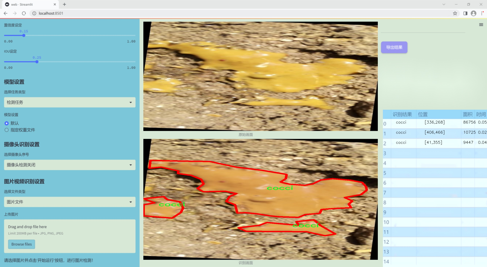
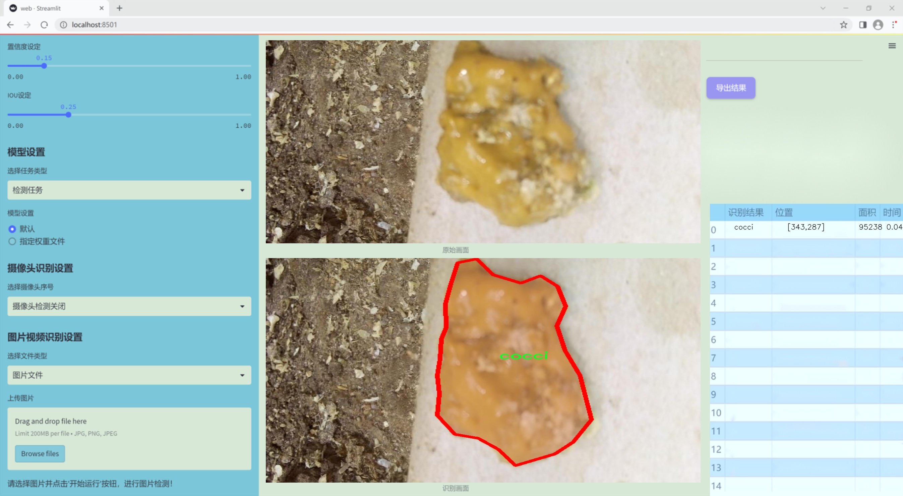
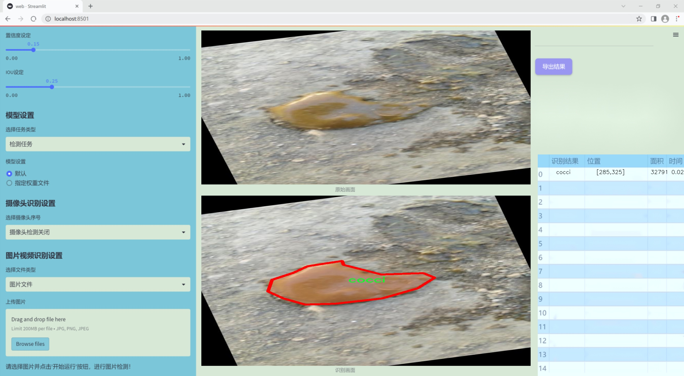
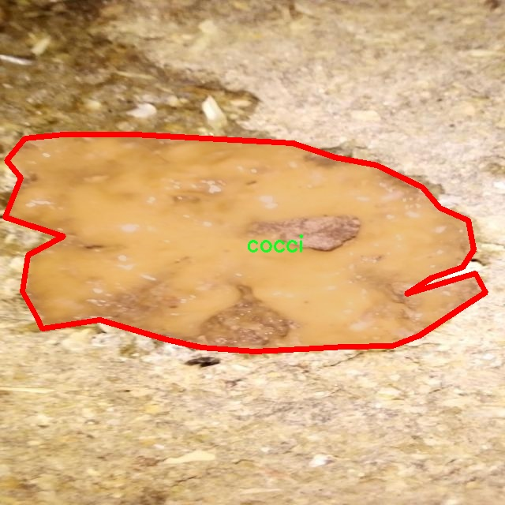
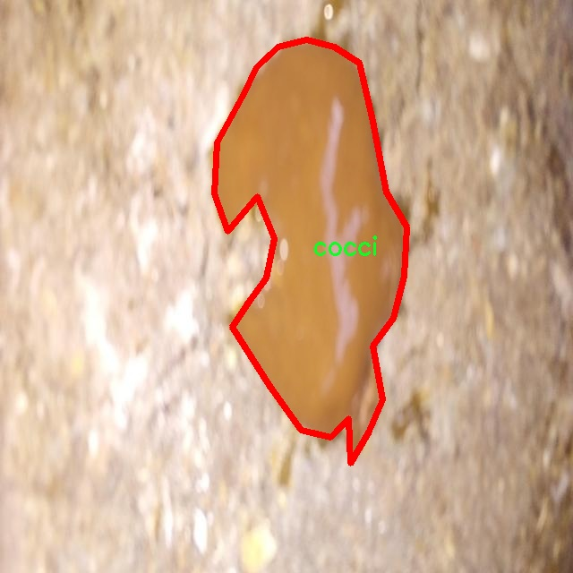
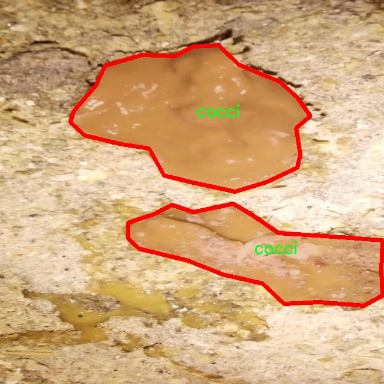
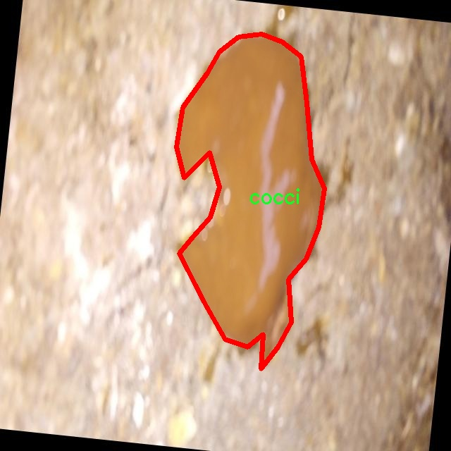
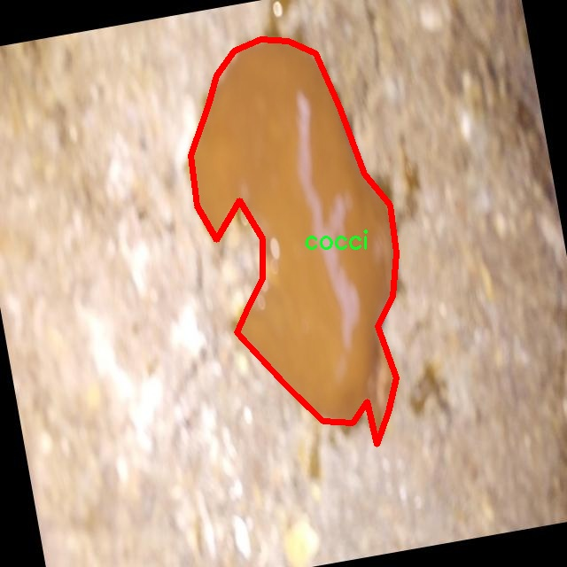

### 1.背景意义

研究背景与意义

在现代农业生产中，鸡粪作为一种重要的有机肥料，广泛应用于土壤改良和作物生长。然而，鸡粪在储存和施用过程中，常常受到各种病害的影响，这不仅影响其肥料效果，还可能对环境和人类健康造成潜在威胁。因此，及时、准确地检测鸡粪中的病害，对于保障农业生产的安全性和可持续性具有重要意义。

近年来，随着计算机视觉技术的迅猛发展，基于深度学习的目标检测方法在农业病害检测中展现出了巨大的潜力。YOLO（You Only Look Once）系列模型因其高效的实时检测能力和较高的准确率，成为了研究者们关注的焦点。特别是YOLOv11的改进版本，通过引入更为先进的特征提取和处理机制，能够在复杂背景下更好地识别和分类不同类型的病害。这为鸡粪病害的自动检测提供了新的技术手段。

本研究旨在基于改进的YOLOv11模型，构建一个高效的鸡粪病害检测系统。该系统将利用一个包含5000张图像的数据集，涵盖了三种主要类别：健康的鸡粪、受球菌感染的鸡粪（cocci）和受沙门氏菌感染的鸡粪（salmo）。通过对这些图像的深度学习训练，系统将能够自动识别和分类鸡粪中的病害，极大地提高检测效率，降低人工成本。

此外，研究还将探讨数据集的构建与增强技术对模型性能的影响。通过随机旋转和图像预处理等方法，进一步提升模型的鲁棒性和适应性。这不仅为鸡粪病害的检测提供了可靠的技术支持，也为其他农业病害的监测和管理提供了借鉴，推动农业智能化的发展。因此，本研究具有重要的理论价值和实际应用意义。

### 2.视频效果

[2.1 视频效果](https://www.bilibili.com/video/BV1fWqGYvEmq/)

### 3.图片效果







##### [项目涉及的源码数据来源链接](https://kdocs.cn/l/cszuIiCKVNis)**

注意：本项目提供训练的数据集和训练教程,由于版本持续更新,暂不提供权重文件（best.pt）,请按照6.训练教程进行训练后实现上图演示的效果。

### 4.数据集信息

##### 4.1 本项目数据集类别数＆类别名

nc: 3
names: ['cocci', 'healthy', 'salmo']


该项目为【图像分割】数据集，请在【训练教程和Web端加载模型教程（第三步）】这一步的时候按照【图像分割】部分的教程来训练

##### 4.2 本项目数据集信息介绍

本项目数据集信息介绍

本项目所使用的数据集旨在支持改进YOLOv11的鸡粪病害检测系统，专注于对鸡粪中可能出现的病害进行精准识别与分类。数据集的主题为“CHICKEN MANURE YOLO”，其设计目的是为了解决在养殖业中常见的鸡粪病害问题，从而提高养殖效率和鸡只健康水平。该数据集包含三种主要类别，分别为“cocci”（球菌感染）、“healthy”（健康状态）和“salmo”（沙门氏菌感染）。这三类的划分不仅有助于快速识别病害，还能为养殖者提供有效的预防和处理建议。

在数据集的构建过程中，研究团队收集了大量真实场景下的鸡粪样本，确保数据的多样性和代表性。每一类样本均经过精心标注，确保模型在训练过程中能够学习到不同病害的特征。数据集中的“cocci”类别主要包含了受球菌感染的鸡粪样本，这类样本通常表现出特定的颜色和质地变化；而“salmo”类别则集中于沙门氏菌感染的样本，具有明显的病变特征；最后，“healthy”类别则代表健康状态下的鸡粪，作为对比样本，帮助模型更好地理解正常与异常之间的差异。

通过使用这一数据集，改进后的YOLOv11模型将能够在实际应用中快速、准确地识别出鸡粪中的病害类型，从而为养殖业提供更为高效的管理方案。这不仅有助于降低疾病传播的风险，还能提升整体养殖效益，促进可持续发展。数据集的多样性和丰富性为模型的训练提供了坚实的基础，使其在实际应用中具备良好的泛化能力和适应性。











### 5.全套项目环境部署视频教程（零基础手把手教学）

[5.1 所需软件PyCharm和Anaconda安装教程（第一步）](https://www.bilibili.com/video/BV1BoC1YCEKi/?spm_id_from=333.999.0.0&vd_source=bc9aec86d164b67a7004b996143742dc)


[5.2 安装Python虚拟环境创建和依赖库安装视频教程（第二步）](https://www.bilibili.com/video/BV1ZoC1YCEBw?spm_id_from=333.788.videopod.sections&vd_source=bc9aec86d164b67a7004b996143742dc)

### 6.改进YOLOv11训练教程和Web_UI前端加载模型教程（零基础手把手教学）

[6.1 改进YOLOv11训练教程和Web_UI前端加载模型教程（第三步）](https://www.bilibili.com/video/BV1BoC1YCEhR?spm_id_from=333.788.videopod.sections&vd_source=bc9aec86d164b67a7004b996143742dc)


按照上面的训练视频教程链接加载项目提供的数据集，运行train.py即可开始训练



     Epoch   gpu_mem       box       obj       cls    labels  img_size
     1/200     20.8G   0.01576   0.01955  0.007536        22      1280: 100%|██████████| 849/849 [14:42<00:00,  1.04s/it]
               Class     Images     Labels          P          R     mAP@.5 mAP@.5:.95: 100%|██████████| 213/213 [01:14<00:00,  2.87it/s]
                 all       3395      17314      0.994      0.957      0.0957      0.0843

     Epoch   gpu_mem       box       obj       cls    labels  img_size
     2/200     20.8G   0.01578   0.01923  0.007006        22      1280: 100%|██████████| 849/849 [14:44<00:00,  1.04s/it]
               Class     Images     Labels          P          R     mAP@.5 mAP@.5:.95: 100%|██████████| 213/213 [01:12<00:00,  2.95it/s]
                 all       3395      17314      0.996      0.956      0.0957      0.0845

     Epoch   gpu_mem       box       obj       cls    labels  img_size
     3/200     20.8G   0.01561    0.0191  0.006895        27      1280: 100%|██████████| 849/849 [10:56<00:00,  1.29it/s]
               Class     Images     Labels          P          R     mAP@.5 mAP@.5:.95: 100%|███████   | 187/213 [00:52<00:00,  4.04it/s]
                 all       3395      17314      0.996      0.957      0.0957      0.0845


###### [项目数据集下载链接](https://kdocs.cn/l/cszuIiCKVNis)

### 7.原始YOLOv11算法讲解


ultralytics发布了最新的作品YOLOv11，这一次YOLOv11的变化相对于ultralytics公司的上一代作品YOLOv8变化不是很大的（YOLOv9、YOLOv10均不是ultralytics公司作品），其中改变的位置涉及到C2f变为C3K2，在SPPF后面加了一层类似于注意力机制的C2PSA，还有一个变化大家从yaml文件是看不出来的就是它的检测头内部替换了两个DWConv，以及模型的深度和宽度参数进行了大幅度调整，但是在损失函数方面就没有变化还是采用的CIoU作为边界框回归损失，下面带大家深入理解一下ultralytics最新作品YOLOv11的创新点。

**下图为最近的YOLO系列发布时间线！**


* * *

###### YOLOv11和YOLOv8对比

在YOLOYOLOv5，YOLOv8，和YOLOv11是ultralytics公司作品（ultralytics出品必属精品），下面用一张图片从yaml文件来带大家对比一下YOLOv8和YOLOv11的区别，配置文件变得内容比较少大家可以看一卡，左侧为YOLOv8右侧为YOLOv11，不同的点我用黑线标注了出来。


* * *

###### YOLOv11的网络结构解析

下面的图片为YOLOv11的网络结构图。


**其中主要创新点可以总结如下- > **

* * *

1\.
提出C3k2机制，其中C3k2有参数为c3k，其中在网络的浅层c3k设置为False（下图中可以看到c3k2第二个参数被设置为False，就是对应的c3k参数）。


此时所谓的C3k2就相当于YOLOv8中的C2f，其网络结构为一致的，其中的C3k机制的网络结构图如下图所示
**（为什么叫C3k2，我个人理解是因为C3k的调用时C3k其中的参数N固定设置为2的原因，个人理解不一定对** ）。


* * *

2\.
第二个创新点是提出C2PSA机制，这是一个C2（C2f的前身）机制内部嵌入了一个多头注意力机制，在这个过程中我还发现作者尝试了C2fPSA机制但是估计效果不如C2PSA，有的时候机制有没有效果理论上真的很难解释通，下图为C2PSA机制的原理图，仔细观察把Attention哪里去掉则C2PSA机制就变为了C2所以我上面说C2PSA就是C2里面嵌入了一个PSA机制。


* * *

3\.
第三个创新点可以说是原先的解耦头中的分类检测头增加了两个DWConv，具体的对比大家可以看下面两个图下面的是YOLOv11的解耦头，上面的是YOLOv8的解耦头.


我们上面看到了在分类检测头中YOLOv11插入了两个DWConv这样的做法可以大幅度减少参数量和计算量（原先两个普通的Conv大家要注意到卷积和是由3变为了1的，这是形成了两个深度可分离Conv），大家可能不太理解为什么加入了两个DWConv还能够减少计算量，以及什么是深度可分离Conv，下面我来解释一下。

> **`DWConv` 代表 Depthwise
> Convolution（深度卷积）**，是一种在卷积神经网络中常用的高效卷积操作。它主要用于减少计算复杂度和参数量，尤其在移动端或轻量化网络（如
> MobileNet）中十分常见。
>
> **1\. 标准卷积的计算过程**
>
> 在标准卷积操作中，对于一个输入张量（通常是一个多通道的特征图），卷积核的尺寸是 `(h, w, C_in)`，其中 `h` 和 `w`
> 是卷积核的空间尺寸，`C_in`
> 是输入通道的数量。而卷积核与输入张量做的是完整的卷积运算，每个输出通道都与所有输入通道相连并参与卷积操作，导致计算量比较大。
>
> 标准卷积的计算过程是这样的：
>
>   * 每个输出通道是所有输入通道的组合（加权求和），卷积核在每个位置都会计算与所有输入通道的点积。
>   * 假设有 `C_in` 个输入通道和 `C_out` 个输出通道，那么卷积核的总参数量是 `C_in * C_out * h * w`。
>

>
> 2\. **Depthwise Convolution（DWConv）**
>
> 与标准卷积不同， **深度卷积** 将输入的每个通道单独处理，即 **每个通道都有自己的卷积核进行卷积**
> ，不与其他通道进行交互。它可以被看作是标准卷积的一部分，专注于空间维度上的卷积运算。
>
> **深度卷积的计算过程：**
>
>   * 假设输入张量有 `C_in` 个通道，每个通道会使用一个 `h × w`
> 的卷积核进行卷积操作。这个过程称为“深度卷积”，因为每个通道独立进行卷积运算。
>   * 输出的通道数与输入通道数一致，每个输出通道只和对应的输入通道进行卷积，没有跨通道的组合。
>   * 参数量和计算量相比标准卷积大大减少，卷积核的参数量是 `C_in * h * w`。
>

>
> **深度卷积的优点：**
>
>   1. **计算效率高** ：相对于标准卷积，深度卷积显著减少了计算量。它只处理空间维度上的卷积，不再处理通道间的卷积。
>   2.  **参数量减少** ：由于每个卷积核只对单个通道进行卷积，参数量大幅减少。例如，标准卷积的参数量为 `C_in * C_out * h *
> w`，而深度卷积的参数量为 `C_in * h * w`。
>   3.  **结合点卷积可提升效果** ：为了弥补深度卷积缺乏跨通道信息整合的问题，通常深度卷积后会配合 `1x1` 的点卷积（Pointwise
> Convolution）使用，通过 `1x1` 的卷积核整合跨通道的信息。这种组合被称为 **深度可分离卷积** （Depthwise
> Separable Convolution） | **这也是我们本文YOLOv11中的做法** 。
>

>
> 3\. **深度卷积与标准卷积的区别**
>
> 操作类型| 卷积核大小| 输入通道数| 输出通道数| 参数量  
> ---|---|---|---|---  
> 标准卷积| `h × w`| `C_in`| `C_out`| `C_in * C_out * h * w`  
> 深度卷积（DWConv）| `h × w`| `C_in`| `C_in`| `C_in * h * w`  
>  
> 可以看出，深度卷积在相同的卷积核大小下，参数量减少了约 `C_out` 倍
> （细心的人可以发现用最新版本的ultralytics仓库运行YOLOv8参数量相比于之前的YOLOv8以及大幅度减少了这就是因为检测头改了的原因但是名字还是Detect，所以如果你想继续用YOLOv8发表论文做实验那么不要更新最近的ultralytics仓库）。
>
> **4\. 深度可分离卷积 (Depthwise Separable Convolution)**
>
> 深度卷积常与 `1x1` 的点卷积配合使用，这称为深度可分离卷积。其过程如下：
>
>   1. 先对输入张量进行深度卷积，对每个通道独立进行空间卷积。
>   2. 然后通过 `1x1` 点卷积，对通道维度进行混合，整合不同通道的信息。
>

>
> 这样既可以保证计算量的减少，又可以保持跨通道的信息流动。
>
> 5\. **总结**
>
> `DWConv` 是一种高效的卷积方式，通过单独处理每个通道来减少计算量，结合 `1x1`
> 的点卷积，形成深度可分离卷积，可以在保持网络性能的同时极大地减少模型的计算复杂度和参数量。

**看到这里大家应该明白了为什么加入了两个DWConv还能减少参数量以及YOLOv11的检测头创新点在哪里。**

* * *

##### YOLOv11和YOLOv8还有一个不同的点就是其各个版本的模型（N - S - M- L - X）网络深度和宽度变了


可以看到在深度（depth）和宽度
（width）两个地方YOLOv8和YOLOv11是基本上完全不同了，这里我理解这么做的含义就是模型网络变小了，所以需要加深一些模型的放缩倍数来弥补模型之前丧失的能力从而来达到一个平衡。

> **本章总结：**
> YOLOv11的改进点其实并不多更多的都是一些小的结构上的创新，相对于之前的YOLOv5到YOLOv8的创新，其实YOLOv11的创新点不算多，但是其是ultralytics公司的出品，同时ultralytics仓库的使用量是非常多的（不像YOLOv9和YOLOv10）所以在未来的很长一段时间内其实YOLO系列估计不会再更新了，YOLOv11作为最新的SOTA肯定是十分适合大家来发表论文和创新的。
>

### 8.200+种全套改进YOLOV11创新点原理讲解

#### 8.1 200+种全套改进YOLOV11创新点原理讲解大全

由于篇幅限制，每个创新点的具体原理讲解就不全部展开，具体见下列网址中的改进模块对应项目的技术原理博客网址【Blog】（创新点均为模块化搭建，原理适配YOLOv5~YOLOv11等各种版本）

[改进模块技术原理博客【Blog】网址链接](https://gitee.com/qunmasj/good)


#### 8.2 精选部分改进YOLOV11创新点原理讲解

###### 这里节选部分改进创新点展开原理讲解(完整的改进原理见上图和[改进模块技术原理博客链接](https://gitee.com/qunmasj/good)【如果此小节的图加载失败可以通过CSDN或者Github搜索该博客的标题访问原始博客，原始博客图片显示正常】

### Gold-YOLO


#### Preliminaries
YOLO系列的中间层结构采用了传统的FPN结构，其中包含多个分支用于多尺度特征融合。然而，它只充分融合来自相邻级别的特征，对于其他层次的信息只能间接地进行“递归”获取。

传统的FPN结构在信息传输过程中存在丢失大量信息的问题。这是因为层之间的信息交互仅限于中间层选择的信息，未被选择的信息在传输过程中被丢弃。这种情况导致某个Level的信息只能充分辅助相邻层，而对其他全局层的帮助较弱。因此，整体上信息融合的有效性可能受到限制。
为了避免在传输过程中丢失信息，本文采用了一种新颖的“聚集和分发”机制（GD），放弃了原始的递归方法。该机制使用一个统一的模块来收集和融合所有Level的信息，并将其分发到不同的Level。通过这种方式，作者不仅避免了传统FPN结构固有的信息丢失问题，还增强了中间层的部分信息融合能力，而且并没有显著增加延迟。


#### 低阶聚合和分发分支 Low-stage gather-and-distribute branch
从主干网络中选择输出的B2、B3、B4、B5特征进行融合，以获取保留小目标信息的高分辨率特征。


#### 高阶聚合和分发分支 High-stage gather-and-distribute branch
高级全局特征对齐模块（High-GD）将由低级全局特征对齐模块（Low-GD）生成的特征{P3, P4, P5}进行融合。


Transformer融合模块由多个堆叠的transformer组成，transformer块的数量为L。每个transformer块包括一个多头注意力块、一个前馈网络（FFN）和残差连接。采用与LeViT相同的设置来配置多头注意力块，使用16个通道作为键K和查询Q的头维度，32个通道作为值V的头维度。为了加速推理过程，将层归一化操作替换为批归一化，并将所有的GELU激活函数替换为ReLU。为了增强变换器块的局部连接，在两个1x1卷积层之间添加了一个深度卷积层。同时，将FFN的扩展因子设置为2，以在速度和计算成本之间取得平衡。


信息注入模块(Information injection module)： 高级全局特征对齐模块（High-GD）中的信息注入模块与低级全局特征对齐模块（Low-GD）中的相同。在高级阶段，局部特征（Flocal）等于Pi，因此公式如下所示：


#### 增强的跨层信息流动 Enhanced cross-layer information flow
为了进一步提升性能，从YOLOv6 中的PAFPN模块中得到启发，引入了Inject-LAF模块。该模块是注入模块的增强版，包括了一个轻量级相邻层融合（LAF）模块，该模块被添加到注入模块的输入位置。为了在速度和准确性之间取得平衡，设计了两个LAF模型：LAF低级模型和LAF高级模型，分别用于低级注入（合并相邻两层的特征）和高级注入（合并相邻一层的特征）。它们的结构如图5(b)所示。为了确保来自不同层级的特征图与目标大小对齐，在实现中的两个LAF模型仅使用了三个操作符：双线性插值（上采样过小的特征）、平均池化（下采样过大的特征）和1x1卷积（调整与目标通道不同的特征）。模型中的LAF模块与信息注入模块的结合有效地平衡了准确性和速度之间的关系。通过使用简化的操作，能够增加不同层级之间的信息流路径数量，从而提高性能而不显著增加延迟。


### 9.系统功能展示

图9.1.系统支持检测结果表格显示

  图9.2.系统支持置信度和IOU阈值手动调节

  图9.3.系统支持自定义加载权重文件best.pt(需要你通过步骤5中训练获得)

  图9.4.系统支持摄像头实时识别

  图9.5.系统支持图片识别

  图9.6.系统支持视频识别

  图9.7.系统支持识别结果文件自动保存

  图9.8.系统支持Excel导出检测结果数据


### 10. YOLOv11核心改进源码讲解

#### 10.1 kacn_conv.py

以下是对代码的核心部分进行保留和详细注释的版本：

```python
import torch
import torch.nn as nn

class KACNConvNDLayer(nn.Module):
    def __init__(self, conv_class, norm_class, input_dim, output_dim, degree, kernel_size,
                 groups=1, padding=0, stride=1, dilation=1,
                 ndim: int = 2, dropout=0.0):
        super(KACNConvNDLayer, self).__init__()
        
        # 初始化参数
        self.inputdim = input_dim  # 输入维度
        self.outdim = output_dim    # 输出维度
        self.degree = degree         # 多项式的度数
        self.kernel_size = kernel_size  # 卷积核大小
        self.padding = padding       # 填充
        self.stride = stride         # 步幅
        self.dilation = dilation     # 膨胀
        self.groups = groups         # 分组卷积的组数
        self.ndim = ndim             # 数据的维度（1D, 2D, 3D）
        self.dropout = None          # Dropout层初始化为None

        # 如果dropout大于0，则根据维度选择相应的Dropout层
        if dropout > 0:
            if ndim == 1:
                self.dropout = nn.Dropout1d(p=dropout)
            elif ndim == 2:
                self.dropout = nn.Dropout2d(p=dropout)
            elif ndim == 3:
                self.dropout = nn.Dropout3d(p=dropout)

        # 检查分组参数的有效性
        if groups <= 0:
            raise ValueError('groups must be a positive integer')
        if input_dim % groups != 0:
            raise ValueError('input_dim must be divisible by groups')
        if output_dim % groups != 0:
            raise ValueError('output_dim must be divisible by groups')

        # 初始化层归一化和多项式卷积层
        self.layer_norm = nn.ModuleList([norm_class(output_dim // groups) for _ in range(groups)])
        self.poly_conv = nn.ModuleList([conv_class((degree + 1) * input_dim // groups,
                                                   output_dim // groups,
                                                   kernel_size,
                                                   stride,
                                                   padding,
                                                   dilation,
                                                   groups=1,
                                                   bias=False) for _ in range(groups)])
        
        # 创建一个缓冲区用于存储多项式的系数
        arange_buffer_size = (1, 1, -1,) + tuple(1 for _ in range(ndim))
        self.register_buffer("arange", torch.arange(0, degree + 1, 1).view(*arange_buffer_size))
        
        # 使用Kaiming均匀分布初始化卷积层的权重
        for conv_layer in self.poly_conv:
            nn.init.normal_(conv_layer.weight, mean=0.0, std=1 / (input_dim * (degree + 1) * kernel_size ** ndim))

    def forward_kacn(self, x, group_index):
        # 对输入应用激活函数并进行线性变换
        x = torch.tanh(x)  # 应用tanh激活函数
        x = x.acos().unsqueeze(2)  # 计算反余弦并增加一个维度
        x = (x * self.arange).flatten(1, 2)  # 乘以多项式系数并展平
        x = x.cos()  # 计算余弦值
        x = self.poly_conv[group_index](x)  # 应用卷积层
        x = self.layer_norm[group_index](x)  # 应用层归一化
        if self.dropout is not None:
            x = self.dropout(x)  # 应用Dropout
        return x

    def forward(self, x):
        # 将输入按组分割
        split_x = torch.split(x, self.inputdim // self.groups, dim=1)
        output = []
        for group_ind, _x in enumerate(split_x):
            y = self.forward_kacn(_x.clone(), group_ind)  # 对每个组进行前向传播
            output.append(y.clone())
        y = torch.cat(output, dim=1)  # 将输出拼接
        return y

# 1D、2D、3D卷积层的具体实现
class KACNConv3DLayer(KACNConvNDLayer):
    def __init__(self, input_dim, output_dim, kernel_size, degree=3, groups=1, padding=0, stride=1, dilation=1,
                 dropout=0.0):
        super(KACNConv3DLayer, self).__init__(nn.Conv3d, nn.BatchNorm3d,
                                              input_dim, output_dim,
                                              degree, kernel_size,
                                              groups=groups, padding=padding, stride=stride, dilation=dilation,
                                              ndim=3, dropout=dropout)

class KACNConv2DLayer(KACNConvNDLayer):
    def __init__(self, input_dim, output_dim, kernel_size, degree=3, groups=1, padding=0, stride=1, dilation=1,
                 dropout=0.0):
        super(KACNConv2DLayer, self).__init__(nn.Conv2d, nn.BatchNorm2d,
                                              input_dim, output_dim,
                                              degree, kernel_size,
                                              groups=groups, padding=padding, stride=stride, dilation=dilation,
                                              ndim=2, dropout=dropout)

class KACNConv1DLayer(KACNConvNDLayer):
    def __init__(self, input_dim, output_dim, kernel_size, degree=3, groups=1, padding=0, stride=1, dilation=1,
                 dropout=0.0):
        super(KACNConv1DLayer, self).__init__(nn.Conv1d, nn.BatchNorm1d,
                                              input_dim, output_dim,
                                              degree, kernel_size,
                                              groups=groups, padding=padding, stride=stride, dilation=dilation,
                                              ndim=1, dropout=dropout)
```

### 代码分析
1. **KACNConvNDLayer**: 这是一个通用的卷积层类，支持任意维度的卷积（1D、2D、3D）。它接受卷积类、归一化类、输入输出维度、卷积参数等作为初始化参数。
2. **forward_kacn**: 这是该类的核心前向传播方法，执行了一系列的数学变换，包括激活、反余弦、余弦计算和卷积操作。
3. **forward**: 该方法将输入按组分割，并对每个组调用`forward_kacn`进行处理，最后将结果拼接。
4. **KACNConv1DLayer、KACNConv2DLayer、KACNConv3DLayer**: 这些是具体的卷积层实现，分别对应1D、2D和3D卷积，继承自`KACNConvNDLayer`。

这些核心部分构成了一个灵活的卷积神经网络层，可以根据需要进行扩展和修改。

这个程序文件 `kacn_conv.py` 定义了一些用于卷积神经网络的自定义层，主要是基于 KACN（Kinematic Activation Convolutional Network）结构的卷积层。文件中包含了一个基类 `KACNConvNDLayer` 和三个具体的卷积层实现，分别用于一维、二维和三维卷积。

首先，`KACNConvNDLayer` 类是一个通用的卷积层类，支持多维卷积。它的构造函数接受多个参数，包括卷积类、归一化类、输入和输出维度、卷积核大小、组数、填充、步幅、扩张、维度数量以及丢弃率。构造函数中，首先会进行一些参数的验证，比如组数必须为正整数，输入和输出维度必须能被组数整除。接着，类会初始化层归一化和多项式卷积层，这些卷积层的数量与组数相同。

在初始化过程中，使用 Kaiming 正态分布对卷积层的权重进行初始化，以便于更好的训练起始。`forward_kacn` 方法实现了前向传播的具体逻辑，它首先对输入进行激活，然后通过多项式卷积层进行线性变换，最后应用层归一化和丢弃层（如果有的话）。`forward` 方法则负责将输入按照组数进行拆分，并对每个组调用 `forward_kacn` 方法，最后将所有组的输出拼接在一起。

接下来的三个类 `KACNConv3DLayer`、`KACNConv2DLayer` 和 `KACNConv1DLayer` 继承自 `KACNConvNDLayer`，分别实现了三维、二维和一维卷积层。它们在构造函数中调用基类的构造函数，并传入相应的卷积和归一化类（如 `nn.Conv3d`、`nn.Conv2d` 和 `nn.Conv1d`，以及对应的批归一化类）。

总的来说，这个文件实现了一个灵活的卷积层结构，支持多种维度的卷积操作，并且通过自定义的激活函数和归一化方式，旨在提升模型的表现和训练效果。

#### 10.2 FreqFusion.py

以下是代码中最核心的部分，并附上详细的中文注释：

```python
import torch
import torch.nn as nn
import torch.nn.functional as F

class FreqFusion(nn.Module):
    def __init__(self, channels, scale_factor=1, lowpass_kernel=5, highpass_kernel=3, **kwargs):
        super().__init__()
        hr_channels, lr_channels = channels
        self.scale_factor = scale_factor
        self.lowpass_kernel = lowpass_kernel
        self.highpass_kernel = highpass_kernel
        
        # 压缩高分辨率和低分辨率特征通道
        self.compressed_channels = (hr_channels + lr_channels) // 8
        self.hr_channel_compressor = nn.Conv2d(hr_channels, self.compressed_channels, 1)
        self.lr_channel_compressor = nn.Conv2d(lr_channels, self.compressed_channels, 1)

        # 低通滤波器生成器
        self.content_encoder = nn.Conv2d(
            self.compressed_channels,
            lowpass_kernel ** 2,
            kernel_size=3,
            padding=1
        )

        # 高通滤波器生成器
        self.content_encoder2 = nn.Conv2d(
            self.compressed_channels,
            highpass_kernel ** 2,
            kernel_size=3,
            padding=1
        )

    def kernel_normalizer(self, mask, kernel):
        """
        对卷积核进行归一化处理
        """
        n, mask_c, h, w = mask.size()
        mask_channel = int(mask_c / float(kernel**2))
        mask = mask.view(n, mask_channel, -1, h, w)
        mask = F.softmax(mask, dim=2)  # 计算softmax以归一化
        mask = mask.view(n, mask_channel, kernel, kernel, h, w)
        mask = mask.permute(0, 1, 4, 5, 2, 3).view(n, -1, kernel, kernel)
        mask /= mask.sum(dim=(-1, -2), keepdims=True)  # 归一化
        return mask

    def forward(self, x):
        """
        前向传播函数
        """
        hr_feat, lr_feat = x  # 输入高分辨率和低分辨率特征
        compressed_hr_feat = self.hr_channel_compressor(hr_feat)  # 压缩高分辨率特征
        compressed_lr_feat = self.lr_channel_compressor(lr_feat)  # 压缩低分辨率特征

        # 生成低通和高通滤波器的掩码
        mask_lr = self.content_encoder(compressed_lr_feat) + self.content_encoder(compressed_hr_feat)
        mask_hr = self.content_encoder2(compressed_hr_feat) + self.content_encoder2(compressed_lr_feat)

        # 对掩码进行归一化
        mask_lr = self.kernel_normalizer(mask_lr, self.lowpass_kernel)
        mask_hr = self.kernel_normalizer(mask_hr, self.highpass_kernel)

        # 使用掩码对低分辨率特征进行处理
        lr_feat = F.conv2d(lr_feat, mask_lr, padding=self.lowpass_kernel // 2)
        hr_feat = F.conv2d(hr_feat, mask_hr, padding=self.highpass_kernel // 2)

        return hr_feat + lr_feat  # 返回融合后的特征
```

### 代码核心部分说明：
1. **类定义**：`FreqFusion` 是一个神经网络模块，继承自 `nn.Module`，用于频率感知特征融合。
2. **初始化方法**：在 `__init__` 方法中，定义了高分辨率和低分辨率特征的通道压缩，以及低通和高通滤波器的生成器。
3. **`kernel_normalizer` 方法**：对生成的掩码进行归一化处理，确保其和为1，以便在后续卷积操作中保持特征的平衡。
4. **前向传播方法**：`forward` 方法接收高分辨率和低分辨率特征，经过压缩和滤波器处理后，返回融合后的特征。

这段代码的核心功能是通过低通和高通滤波器对输入特征进行处理，从而实现特征的融合，提升图像预测的精度。

这个程序文件 `FreqFusion.py` 实现了一种名为“频率感知特征融合”的深度学习模型，主要用于密集图像预测任务。代码使用了 PyTorch 框架，并包含了一些图像处理和特征融合的技术。

首先，文件导入了必要的库，包括 PyTorch 的核心模块和一些用于图像处理的函数。它还尝试从 `mmcv` 库中导入一些操作，如果导入失败则不做处理。接着，定义了一些初始化函数，如 `normal_init` 和 `constant_init`，用于对神经网络的权重和偏置进行初始化。

`resize` 函数用于调整输入张量的大小，使用了插值方法，并在某些情况下发出警告，以确保输出的对齐方式是合理的。`hamming2D` 函数生成一个二维的 Hamming 窗，用于后续的正则化处理。

接下来，定义了 `FreqFusion` 类，这是实现频率感知特征融合的核心模块。构造函数中，初始化了一些参数，包括通道数、卷积核大小、上采样因子等。该类使用了多个卷积层来处理高分辨率和低分辨率的特征图，并生成用于特征融合的掩码。

在 `init_weights` 方法中，对卷积层的权重进行初始化，确保模型在训练开始时具有良好的性能。`kernel_normalizer` 方法用于对生成的掩码进行归一化处理，以确保它们的和为1。

`forward` 方法是模型的前向传播函数，接收高分辨率和低分辨率的特征图，并通过一系列卷积和融合操作生成最终的输出。该方法支持使用检查点机制来节省内存。

`LocalSimGuidedSampler` 类是一个辅助模块，用于生成偏移量以进行特征重采样。它使用局部相似性来指导重采样过程，从而提高生成图像的质量。

最后，`compute_similarity` 函数用于计算输入张量中每个点与其周围点的余弦相似度，帮助模型在特征融合时考虑局部上下文信息。

整体来看，这个文件实现了一个复杂的图像处理模型，结合了频率域的特征处理和深度学习的卷积网络结构，旨在提高图像预测的精度和质量。

#### 10.3 mamba_yolo.py

以下是代码中最核心的部分，并附上详细的中文注释：

```python
import torch
import torch.nn as nn
from einops import rearrange

class LayerNorm2d(nn.Module):
    """
    2D层归一化类
    """
    def __init__(self, normalized_shape, eps=1e-6, elementwise_affine=True):
        super().__init__()
        # 初始化LayerNorm
        self.norm = nn.LayerNorm(normalized_shape, eps, elementwise_affine)

    def forward(self, x):
        # 输入x的形状为 (B, C, H, W)，需要调整为 (B, H, W, C) 进行归一化
        x = rearrange(x, 'b c h w -> b h w c').contiguous()
        x = self.norm(x)  # 进行归一化
        # 再次调整回 (B, C, H, W)
        x = rearrange(x, 'b h w c -> b c h w').contiguous()
        return x

class CrossScan(torch.autograd.Function):
    """
    跨扫描操作
    """
    @staticmethod
    def forward(ctx, x: torch.Tensor):
        B, C, H, W = x.shape
        ctx.shape = (B, C, H, W)
        xs = x.new_empty((B, 4, C, H * W))  # 创建一个新的张量用于存储结果
        xs[:, 0] = x.flatten(2, 3)  # 将x展平
        xs[:, 1] = x.transpose(dim0=2, dim1=3).flatten(2, 3)  # 转置并展平
        xs[:, 2:4] = torch.flip(xs[:, 0:2], dims=[-1])  # 翻转前两个维度
        return xs

    @staticmethod
    def backward(ctx, ys: torch.Tensor):
        B, C, H, W = ctx.shape
        L = H * W
        # 反向传播时的计算
        ys = ys[:, 0:2] + ys[:, 2:4].flip(dims=[-1]).view(B, 2, -1, L)
        y = ys[:, 0] + ys[:, 1].view(B, -1, W, H).transpose(dim0=2, dim1=3).contiguous().view(B, -1, L)
        return y.view(B, -1, H, W)

class SelectiveScanCore(torch.autograd.Function):
    """
    选择性扫描核心操作
    """
    @staticmethod
    @torch.cuda.amp.custom_fwd
    def forward(ctx, u, delta, A, B, C, D=None, delta_bias=None, delta_softplus=False, nrows=1, backnrows=1,
                oflex=True):
        # 确保输入张量是连续的
        if u.stride(-1) != 1:
            u = u.contiguous()
        if delta.stride(-1) != 1:
            delta = delta.contiguous()
        if D is not None and D.stride(-1) != 1:
            D = D.contiguous()
        if B.stride(-1) != 1:
            B = B.contiguous()
        if C.stride(-1) != 1:
            C = C.contiguous()
        if B.dim() == 3:
            B = B.unsqueeze(dim=1)  # 扩展维度
            ctx.squeeze_B = True
        if C.dim() == 3:
            C = C.unsqueeze(dim=1)  # 扩展维度
            ctx.squeeze_C = True
        
        # 进行选择性扫描的前向计算
        out, x, *rest = selective_scan_cuda_core.fwd(u, delta, A, B, C, D, delta_bias, delta_softplus, 1)
        ctx.save_for_backward(u, delta, A, B, C, D, delta_bias, x)  # 保存用于反向传播的张量
        return out

    @staticmethod
    @torch.cuda.amp.custom_bwd
    def backward(ctx, dout, *args):
        u, delta, A, B, C, D, delta_bias, x = ctx.saved_tensors
        if dout.stride(-1) != 1:
            dout = dout.contiguous()
        # 进行选择性扫描的反向计算
        du, ddelta, dA, dB, dC, dD, ddelta_bias, *rest = selective_scan_cuda_core.bwd(
            u, delta, A, B, C, D, delta_bias, dout, x, ctx.delta_softplus, 1
        )
        return (du, ddelta, dA, dB, dC, dD, ddelta_bias, None, None, None, None)

def cross_selective_scan(
        x: torch.Tensor = None,
        x_proj_weight: torch.Tensor = None,
        x_proj_bias: torch.Tensor = None,
        dt_projs_weight: torch.Tensor = None,
        dt_projs_bias: torch.Tensor = None,
        A_logs: torch.Tensor = None,
        Ds: torch.Tensor = None,
        out_norm: torch.nn.Module = None,
        out_norm_shape="v0",
        nrows=-1,
        backnrows=-1,
        delta_softplus=True,
        to_dtype=True,
        force_fp32=False,
        ssoflex=True,
        SelectiveScan=None,
        scan_mode_type='default'
):
    """
    跨选择性扫描操作
    """
    B, D, H, W = x.shape
    D, N = A_logs.shape
    K, D, R = dt_projs_weight.shape
    L = H * W

    # 定义选择性扫描的内部函数
    def selective_scan(u, delta, A, B, C, D=None, delta_bias=None, delta_softplus=True):
        return SelectiveScan.apply(u, delta, A, B, C, D, delta_bias, delta_softplus, nrows, backnrows, ssoflex)

    xs = CrossScan.apply(x)  # 应用跨扫描操作

    # 进行权重投影
    x_dbl = torch.einsum("b k d l, k c d -> b k c l", xs, x_proj_weight)
    if x_proj_bias is not None:
        x_dbl = x_dbl + x_proj_bias.view(1, K, -1, 1)
    
    # 拆分投影结果
    dts, Bs, Cs = torch.split(x_dbl, [R, N, N], dim=2)
    dts = torch.einsum("b k r l, k d r -> b k d l", dts, dt_projs_weight)
    xs = xs.view(B, -1, L)
    dts = dts.contiguous().view(B, -1, L)

    # HiPPO矩阵
    As = -torch.exp(A_logs.to(torch.float))  # 计算A
    Bs = Bs.contiguous()
    Cs = Cs.contiguous()
    Ds = Ds.to(torch.float)  # 转换为浮点型
    delta_bias = dt_projs_bias.view(-1).to(torch.float)

    # 进行选择性扫描
    ys: torch.Tensor = selective_scan(
        xs, dts, As, Bs, Cs, Ds, delta_bias, delta_softplus
    ).view(B, K, -1, H, W)

    # 进行合并操作
    y: torch.Tensor = CrossMerge.apply(ys)

    # 进行输出归一化
    if out_norm_shape in ["v1"]:
        y = out_norm(y.view(B, -1, H, W)).permute(0, 2, 3, 1)
    else:
        y = y.transpose(dim0=1, dim1=2).contiguous()
        y = out_norm(y).view(B, H, W, -1)

    return (y.to(x.dtype) if to_dtype else y)

class SS2D(nn.Module):
    """
    SS2D模块
    """
    def __init__(self, d_model=96, d_state=16, ssm_ratio=2.0, ssm_rank_ratio=2.0, dt_rank="auto", act_layer=nn.SiLU, dropout=0.0, bias=False, forward_type="v2", **kwargs):
        super().__init__()
        d_expand = int(ssm_ratio * d_model)  # 扩展维度
        d_inner = int(min(ssm_rank_ratio, ssm_ratio) * d_model) if ssm_rank_ratio > 0 else d_expand
        self.dt_rank = math.ceil(d_model / 16) if dt_rank == "auto" else dt_rank
        self.d_state = math.ceil(d_model / 6) if d_state == "auto" else d_state  # 20240109
        self.K = 4

        # 输入投影
        self.in_proj = nn.Conv2d(d_model, d_expand, kernel_size=1, stride=1, groups=1, bias=bias)
        self.act: nn.Module = nn.GELU()

        # 输出投影
        self.out_proj = nn.Conv2d(d_expand, d_model, kernel_size=1, stride=1, bias=bias)
        self.dropout = nn.Dropout(dropout) if dropout > 0. else nn.Identity()

        # 初始化参数
        self.Ds = nn.Parameter(torch.ones((self.K * d_inner)))
        self.A_logs = nn.Parameter(torch.zeros((self.K * d_inner, self.d_state)))  # A == -A_logs.exp() < 0
        self.dt_projs_weight = nn.Parameter(torch.randn((self.K, d_inner, self.dt_rank)))
        self.dt_projs_bias = nn.Parameter(torch.randn((self.K, d_inner)))

    def forward_corev2(self, x: torch.Tensor, channel_first=False, SelectiveScan=SelectiveScanCore, cross_selective_scan=cross_selective_scan, force_fp32=None):
        if not channel_first:
            x = x.permute(0, 3, 1, 2).contiguous()  # 调整维度
        x = cross_selective_scan(
            x, self.x_proj_weight, None, self.dt_projs_weight, self.dt_projs_bias,
            self.A_logs, self.Ds,
            out_norm=getattr(self, "out_norm", None),
            out_norm_shape=getattr(self, "out_norm_shape", "v0"),
            delta_softplus=True, force_fp32=force_fp32,
            SelectiveScan=SelectiveScan, ssoflex=self.training,
        )
        return x

    def forward(self, x: torch.Tensor, **kwargs):
        x = self.in_proj(x)  # 输入投影
        x = self.act(x)  # 激活函数
        y = self.forward_core(x)  # 核心前向计算
        out = self.dropout(self.out_proj(y))  # 输出投影和dropout
        return out
```

### 代码核心部分说明：
1. **LayerNorm2d**: 实现了2D层归一化，用于处理图像数据的归一化。
2. **CrossScan**: 实现了跨扫描操作，能够对输入张量进行多维度的展平和翻转。
3. **SelectiveScanCore**: 选择性扫描的核心操作，负责前向和反向传播的计算。
4. **cross_selective_scan**: 实现了跨选择性扫描的功能，结合了输入的多个参数进行复杂的计算。
5. **SS2D**: 主要模块，包含输入投影、输出投影、以及核心的选择性扫描逻辑。

以上代码是实现深度学习模型中的一些重要操作，主要用于图像处理和特征提取。

这个程序文件 `mamba_yolo.py` 是一个实现 YOLO（You Only Look Once）目标检测模型的 PyTorch 代码。代码中定义了多个类和函数，主要用于构建神经网络的不同模块和操作。以下是对代码的详细说明：

首先，代码导入了必要的库，包括 PyTorch、数学运算、类型提示等。接着，定义了一些辅助函数和类，例如 `LayerNorm2d`，它实现了二维层归一化，适用于图像数据。该类在前向传播中将输入张量的维度重新排列，以便进行归一化处理。

接下来，定义了 `autopad` 函数，用于根据卷积核的大小自动计算填充，以保持输出形状与输入形状相同。

然后，代码中实现了几个重要的自定义操作，包括 `CrossScan` 和 `CrossMerge`。`CrossScan` 类用于对输入张量进行交叉扫描，生成不同方向的特征图；而 `CrossMerge` 类则用于将这些特征图合并。

`SelectiveScanCore` 类实现了选择性扫描的核心功能，通过自定义的前向和反向传播方法，支持在 GPU 上高效计算。`cross_selective_scan` 函数则是对选择性扫描的封装，提供了多种参数选项，以便在不同的情况下使用。

接下来，定义了 `SS2D` 类，这是一个重要的模块，结合了选择性扫描和卷积操作。该类的构造函数中定义了输入和输出的投影层、卷积层以及其他参数，允许在训练过程中进行灵活的调整。

`RGBlock` 和 `LSBlock` 类实现了不同的网络块，分别用于特征提取和信息融合。`XSSBlock` 和 `VSSBlock_YOLO` 类则是更复杂的模块，结合了多个前面定义的组件，形成了 YOLO 模型的基本结构。

`SimpleStem` 类实现了模型的初始卷积层，负责将输入图像转换为特征图。`VisionClueMerge` 类则用于在不同分辨率的特征图之间进行合并，增强模型的表达能力。

整体来看，这个文件实现了一个高度模块化的 YOLO 模型，允许用户根据需求进行定制和扩展。每个模块都经过精心设计，以实现高效的特征提取和目标检测功能。通过使用选择性扫描和其他先进的技术，模型能够在处理复杂场景时保持高效性和准确性。

#### 10.4 mobilenetv4.py

以下是保留的核心代码部分，并附上详细的中文注释：

```python
import torch
import torch.nn as nn

# 定义一个函数，用于确保所有层的通道数是8的倍数
def make_divisible(value: float, divisor: int, min_value: Optional[float] = None, round_down_protect: bool = True) -> int:
    """
    确保通道数是divisor的倍数
    Args:
        value: 原始值
        divisor: 需要检查的除数
        min_value: 最小值阈值
        round_down_protect: 是否允许向下取整超过10%
    Returns:
        调整后的值，确保是int类型并且是divisor的倍数
    """
    if min_value is None:
        min_value = divisor
    new_value = max(min_value, int(value + divisor / 2) // divisor * divisor)
    if round_down_protect and new_value < 0.9 * value:
        new_value += divisor
    return int(new_value)

# 定义一个2D卷积层的构建函数
def conv_2d(inp, oup, kernel_size=3, stride=1, groups=1, bias=False, norm=True, act=True):
    """
    构建一个2D卷积层，包含卷积、批归一化和激活函数
    Args:
        inp: 输入通道数
        oup: 输出通道数
        kernel_size: 卷积核大小
        stride: 步幅
        groups: 分组卷积的组数
        bias: 是否使用偏置
        norm: 是否使用批归一化
        act: 是否使用激活函数
    Returns:
        nn.Sequential: 包含卷积、批归一化和激活函数的序列
    """
    conv = nn.Sequential()
    padding = (kernel_size - 1) // 2
    conv.add_module('conv', nn.Conv2d(inp, oup, kernel_size, stride, padding, bias=bias, groups=groups))
    if norm:
        conv.add_module('BatchNorm2d', nn.BatchNorm2d(oup))
    if act:
        conv.add_module('Activation', nn.ReLU6())
    return conv

# 定义反向残差块
class InvertedResidual(nn.Module):
    def __init__(self, inp, oup, stride, expand_ratio, act=False):
        """
        初始化反向残差块
        Args:
            inp: 输入通道数
            oup: 输出通道数
            stride: 步幅
            expand_ratio: 扩展比例
            act: 是否使用激活函数
        """
        super(InvertedResidual, self).__init__()
        self.stride = stride
        assert stride in [1, 2]  # 步幅只能是1或2
        hidden_dim = int(round(inp * expand_ratio))  # 计算隐藏层的通道数
        self.block = nn.Sequential()
        if expand_ratio != 1:
            self.block.add_module('exp_1x1', conv_2d(inp, hidden_dim, kernel_size=1, stride=1))  # 扩展卷积
        self.block.add_module('conv_3x3', conv_2d(hidden_dim, hidden_dim, kernel_size=3, stride=stride, groups=hidden_dim))  # 深度卷积
        self.block.add_module('red_1x1', conv_2d(hidden_dim, oup, kernel_size=1, stride=1, act=act))  # 投影卷积
        self.use_res_connect = self.stride == 1 and inp == oup  # 判断是否使用残差连接

    def forward(self, x):
        if self.use_res_connect:
            return x + self.block(x)  # 使用残差连接
        else:
            return self.block(x)

# 定义MobileNetV4模型
class MobileNetV4(nn.Module):
    def __init__(self, model):
        """
        初始化MobileNetV4模型
        Args:
            model: 模型类型
        """
        super().__init__()
        self.model = model
        # 根据模型类型构建各个层
        self.conv0 = build_blocks(self.spec['conv0'])
        self.layer1 = build_blocks(self.spec['layer1'])
        self.layer2 = build_blocks(self.spec['layer2'])
        self.layer3 = build_blocks(self.spec['layer3'])
        self.layer4 = build_blocks(self.spec['layer4'])
        self.layer5 = build_blocks(self.spec['layer5'])
        self.features = nn.ModuleList([self.conv0, self.layer1, self.layer2, self.layer3, self.layer4, self.layer5])     

    def forward(self, x):
        """
        前向传播
        Args:
            x: 输入数据
        Returns:
            features: 特征列表
        """
        input_size = x.size(2)
        scale = [4, 8, 16, 32]
        features = [None, None, None, None]
        for f in self.features:
            x = f(x)
            if input_size // x.size(2) in scale:
                features[scale.index(input_size // x.size(2))] = x
        return features

# 定义不同类型的MobileNetV4模型的构建函数
def MobileNetV4ConvSmall():
    return MobileNetV4('MobileNetV4ConvSmall')

def MobileNetV4ConvMedium():
    return MobileNetV4('MobileNetV4ConvMedium')

def MobileNetV4ConvLarge():
    return MobileNetV4('MobileNetV4ConvLarge')

def MobileNetV4HybridMedium():
    return MobileNetV4('MobileNetV4HybridMedium')

def MobileNetV4HybridLarge():
    return MobileNetV4('MobileNetV4HybridLarge')

if __name__ == '__main__':
    model = MobileNetV4ConvSmall()  # 创建一个MobileNetV4ConvSmall模型
    inputs = torch.randn((1, 3, 640, 640))  # 生成随机输入
    res = model(inputs)  # 前向传播
    for i in res:
        print(i.size())  # 打印输出特征的尺寸
```

### 代码说明
1. **make_divisible**: 确保通道数是8的倍数，避免不必要的计算。
2. **conv_2d**: 构建一个包含卷积、批归一化和激活函数的2D卷积层。
3. **InvertedResidual**: 定义反向残差块，使用深度卷积和1x1卷积进行特征提取。
4. **MobileNetV4**: 定义MobileNetV4模型，包含多个卷积层和反向残差块。
5. **模型构建函数**: 提供不同版本的MobileNetV4模型构建接口。

这个程序文件定义了一个名为 `MobileNetV4` 的深度学习模型，主要用于图像分类等计算机视觉任务。该模型是 MobileNet 系列的一部分，专注于在移动设备上实现高效的卷积神经网络（CNN）。以下是对代码的详细讲解。

首先，程序导入了必要的库，包括 `torch` 和 `torch.nn`，这些库是 PyTorch 深度学习框架的核心组件。接着，定义了一些模型的规格，包括不同大小的 MobileNetV4 变体（小型、中型、大型和混合型）。这些规格以字典的形式存储，描述了每个层的类型、数量和参数。

在 `make_divisible` 函数中，确保每个层的通道数是可被8整除的，这在某些硬件上可以提高性能。这个函数接收一个值和一个除数，计算出一个符合条件的整数值。

`conv_2d` 函数用于构建一个二维卷积层，包含卷积操作、批归一化和激活函数（ReLU6）。这个函数的灵活性在于可以选择是否包含归一化和激活。

`InvertedResidual` 类实现了倒残差块，这是 MobileNetV4 的核心构建块之一。它使用了深度可分离卷积，通过扩展和压缩通道数来提高模型的表达能力。

`UniversalInvertedBottleneckBlock` 类是另一个重要的构建块，允许更灵活的卷积结构，包括不同大小的卷积核和下采样选项。

`build_blocks` 函数根据层的规格构建相应的层，支持不同类型的卷积块（如 `convbn`、`uib` 和 `fused_ib`）。

`MobileNetV4` 类是模型的主要实现。它在初始化时根据传入的模型名称构建各个层，并将它们存储在一个模块列表中。`forward` 方法定义了模型的前向传播过程，返回不同尺度的特征图。

最后，文件中定义了一些工厂函数（如 `MobileNetV4ConvSmall`、`MobileNetV4ConvMedium` 等），用于创建不同变体的 MobileNetV4 模型。在 `__main__` 块中，创建了一个小型模型并对随机输入进行了前向传播，输出了每个特征图的尺寸。

总体来说，这个文件提供了一个灵活且高效的 MobileNetV4 实现，适用于各种计算机视觉任务。通过不同的模型规格，用户可以根据需求选择合适的模型，以在性能和效率之间取得平衡。

### 11.完整训练+Web前端界面+200+种全套创新点源码、数据集获取


# [下载链接：https://mbd.pub/o/bread/Z5yYm5hp](https://mbd.pub/o/bread/Z5yYm5hp)